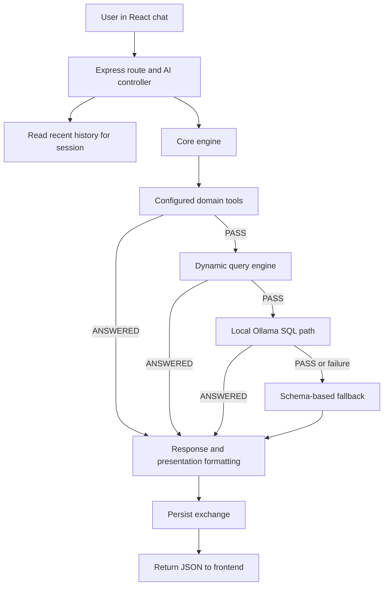

# CogniCore Project: In-Depth System and Completion Report

**Prepared:** 23 September 2026  
**Project root:** `/home/shubh/Documents/project/cognicore/Cognicore/`  
**Application root:** `CogniCore_Project/`  
**Review type:** Static code and documentation review. Tests, builds, benchmarks, and live services were not run for this report.

## Executive summary

CogniCore is a local-first natural-language analytics application. A user uploads or selects a SQLite database, asks a question in ordinary language, and receives an answer with source metadata and, where available, SQL and result data. The React frontend talks to an Express backend. The backend combines fixed domain tools, a deterministic query engine, a local Ollama model, and a fallback response in a sequential pipeline.

The codebase has a useful foundation: modular query links, schema discovery, parameterized plans in deterministic paths, a local LLM adapter, a layered LLM SQL gate, saved conversation history, additive response formatting, test fixtures, and many focused verification scripts. The product is presently best described as a working analytics MVP with selected education and hospital tools. It is not yet a complete enterprise copilot: authentication, authorization, robust database lifecycle controls, document retrieval, production operations, and broad usability/acceptance criteria remain either missing or incomplete.

Three documents describe different levels of ambition. The runtime code is centered on SQLite analytics and local Ollama. `MASTER_CONTEXT.md` documents reliability work and known edge cases. `CogniCore_Project_Status_and_Roadmap.md` describes a larger intended platform with SQL, retrieval-augmented generation (RAG), tools/actions, dashboards, reports, identity, and role-based access control (RBAC). This report keeps implemented behavior separate from those planned capabilities.

## 1. Project purpose and scope

### 1.1 Current product behavior

The implemented application is designed to:

- Connect to a SQLite database and inspect its tables, columns, keys, and selected sample values.
- Accept a plain-language question through a chat interface.
- Route some questions to deterministic education or hospital tools.
- Attempt deterministic query recognition and SQL construction for common query shapes.
- Use a local Ollama model when the deterministic paths do not handle a question.
- Validate and execute LLM-generated read queries, then convert database rows into an answer.
- Keep a limited session conversation history in a separate SQLite database.
- Return presentation data for tables, metrics, charts, reports, and CSV export.
- Upload and activate a SQLite file while the backend remains running.

### 1.2 Intended product direction

Project planning documents describe a broader, domain-agnostic enterprise copilot. The target concept includes a query router that can select SQL, RAG, a controlled tool, or a hybrid of these; semantic schema understanding; document ingestion; user roles; dashboards; report generation; and controlled automations. These are roadmap goals, not all present in the current runtime code.

### 1.3 Technology stack

- **Backend:** Node.js ES modules, Express 5, SQLite through `sqlite3` and `sqlite`.
- **LLM:** Ollama-compatible local HTTP API, configured through environment variables.
- **SQL structure validation:** `node-sql-parser` AST parsing, plus the project SQL validator.
- **Frontend:** React 19, Vite 7, Vega and Vega-Lite.
- **Persistence:** Active database pointer in JSON; history in a separate SQLite database using WAL mode.
- **Runtime prerequisite:** Node.js 20 or newer according to both package manifests.

## 2. Repository map

```text
cognicore/
├── AGENTS.md                         # Repository-specific working constraints
├── .gitignore
├── student_erp.db                    # Database artifact at repository root
└── Cognicore/
    ├── README.md                     # Product summary and entry points
    ├── ARCHITECTURE.md               # Claimed pipeline, seams, and safety model
    ├── SECURITY.md                   # Claimed SQL safety model
    ├── GETTING_STARTED.md            # Local setup instructions
    ├── TESTING.md                    # Manual verification suite guidance
    ├── MASTER_CONTEXT.md             # Historical decisions, metrics, open edges
    ├── ROADMAP.md                    # Part A/Part B implementation status
    ├── CHAT_CONTEXT.md               # Handoff from the previous Codex review
    ├── docs/
    │   ├── AUDIT_REPORT.md
    │   ├── PART_A_RECORD.md
    │   └── PART_B_RECORD.md
    ├── test/                         # Additional top-level verification scripts
    └── CogniCore_Project/
        ├── README.md
        ├── PROJECT_CONTEXT.md
        ├── COGNICORE_CODEBASE_AUDIT_AND_DECOMPOSITION.md
        ├── backend/
        │   ├── package.json          # Backend scripts and dependencies
        │   ├── active-database.json  # Persisted active SQLite path
        │   ├── database/             # Demo database generation/setup tools
        │   ├── fixtures/             # Example SQLite databases
        │   ├── uploads/              # Uploaded databases (ignored by git)
        │   ├── data/                 # History database location
        │   ├── src/
        │   │   ├── server.js
        │   │   ├── config/
        │   │   ├── controllers/
        │   │   ├── routes/
        │   │   ├── core/
        │   │   ├── kernel/
        │   │   ├── llm/
        │   │   ├── store/
        │   │   └── tools/
        │   └── test/                 # Unit-like checks, integration scripts, fixtures
        └── frontend/
            ├── package.json
            ├── index.html
            ├── src/
            │   ├── main.jsx
            │   ├── style.css
            │   ├── lib/
            │   └── components/
            └── dist/                 # Built frontend output is present
```

There are also nested `node_modules` and database fixture files in the project. They are not application source and were not reviewed file by file. The outer repository showed untracked project files at the time of inspection; re-check `git status` before treating this report as a tracked baseline or committing it.

## 3. Runtime architecture

### 3.1 Request path



`server.js` mounts the AI router under `/api/ai`, `/api/llm`, and `/api`, and the database router under `/api/database`. The AI router handles query submission, model discovery, and history. The database router handles active-database lookup, direct switching, and upload.

### 3.2 Core pipeline and handler contract

`core.engine.js` obtains an intent, builds context (query, organization, role, model, session, attempts, and trace), and walks the configured sequence in `kernel/pipeline.config.js`. Links return the vocabulary defined in `kernel/handler-result.js`: `ANSWERED`, `PASS`, `ABSTAIN`, or `BUG`. The first answered response ends the cascade. A trace is attached to the response metadata.

The configured order is:

1. **Configured Tools** — exact intent-to-tool map for education CGPA, foreign students, and hospital visit analytics.
2. **Dynamic Query Engine** — deterministic intent routing and heuristic SQL plans.
3. **Local LLM** — schema-aware SQL generation, gates, read-only execution, and result formatting.
4. **Helpful Fallback** — reports available tables and suggested query styles.

The kernel also contains a capability object that packages database and LLM modules, a gate chain, and a closed formatter registry. This gives the code a useful separation between orchestration and infrastructure, though some modules still import database infrastructure directly.

## 4. Backend subsystem descriptions

### 4.1 Server, routes, and controllers

- `backend/src/server.js` configures Express, CORS, JSON parsing, health endpoints, API mounts, and error middleware.
- `routes/ai.routes.js` maps query, models, and history endpoints to the AI controller.
- `routes/database.routes.js` configures Multer disk upload with an extension filter and a 50 MB per-file size limit, then maps active/switch/upload endpoints.
- `controllers/ai.controller.js` validates that a query is nonempty, accepts/generates a session ID, invokes the core engine, stores the exchange, and attaches a presentation format. It also fetches Ollama model tags.
- `controllers/database.controller.js` checks the uploaded file’s SQLite magic header and delegates to the active database switcher. It exposes the active path and accepts a path for direct switching.

### 4.2 Database lifecycle and schema discovery

`config/database.js` stores the active database path, creates a normal read/write connection, lazily creates a read-only connection, persists the path through a temporary file and rename, and serializes database switch requests through a promise queue. It supports the `COGNICORE_ACTIVE_DB` environment override and switch hooks for cache invalidation.

`core/schema.reader.js` reads table names, column metadata, primary keys, foreign keys, row counts, and a limited set of text sample values. It computes a schema-definition hash and caches enriched schema by active path. `core/distinct.cache.js` separately maintains bounded distinct-value samples for deterministic matching and is intended to clear on database switches.

`core/schema.pruner.js` ranks tables against query tokens and adds connected tables through foreign-key paths, reducing prompt schema size. `core/schema.resolver.js` normalizes words, handles common plural/singular forms, applies configured aliases, resolves tables/columns, and chooses numeric columns while avoiding ID fields.

### 4.3 Deterministic SQL and intent routing

`core/intent.detector.js` identifies domain intents. `core/tool.router.js` maps these to fixed tools.

`core/fastIntent.js` is a large deterministic natural-language router for common query shapes. It uses schema names and distinct values, token and numeric parsing, and builds SQL plans with bound parameters. It handles common counts, filters, aggregates, ranking/top-N patterns, and related shapes. It declines when the question is ambiguous or unsupported so a later link can try.

`core/sql.builder.js` constructs a narrower set of generic one-table plans using quoted identifiers and resolved table/column information. `core/query.executor.js` executes plans as `get` or `all` and returns a structured success/error result. `core/response.formatter.js` turns the result and operation metadata into answer text and a data object. `core/result.sanity.js` checks some scalar SUM/AVG results for likely boolean-column misuse. `core/guard-markers.js` contains guards for semantic pattern classes.

### 4.4 LLM generation and safety gates

`llm/llm.client.js` calls an Ollama-compatible `/api/generate` endpoint with a timeout, model selection, and one compatibility retry without the `think` option. `llm/sql.prompt.js` builds the SQL-only instruction using a pruned schema, inferred relationships, sample values, recent session context, and examples. `llm.formatter.js` shapes returned rows and SQL into a standard response.

`llm/sql.validator.js` is a frozen project file. Its implementation requires the output to start with `SELECT` or `WITH`, rejects a keyword list, comments, and internal semicolons, removes some LLM formatting, and adds or adjusts a trailing LIMIT. `kernel/ast.gate.js` parses the statement and applies function, table/column, and grouping checks. `kernel/gate.chain.js` sequences validator, AST check, and read-only execution for the LLM route. The LLM link can ask for one corrected SQL attempt after selected gate failures and performs a case-insensitive retry for some zero-result equality queries.

The configured tools use static SQL templates with bound values in many places, but access the normal database connection. The heuristic dynamic path also has a normal-connection issue described in the flaws chapter. Thus the read-only property should be understood as applying to particular paths, not as proven universal enforcement.

### 4.5 Tools and supported fixed domains

- `tools/education/cgpa.tool.js` parses a CGPA threshold/operator and returns a count and at most 50 matching rows from the expected `students.cgpa` schema.
- `tools/education/foreign-student.tool.js` queries `students` using country and optional enrollment year, with a 50-row result cap.
- `tools/hospital/cardiology.tool.js` resolves a department and date filter against `hospital_visits`, returning counts and up to 50 recent rows.

These tools are useful fast paths but rely on expected table/column schemas. The dynamic and LLM links are needed for other databases and schemas.

### 4.6 History and response formatters

`store/history.store.js` creates a separate history DB, enables WAL mode, and stores questions, answers, source, SQL, model, timestamp, and session ID. It provides recent and full-history reads.

`kernel/formatter.registry.js` is a closed map of pure formatters for KPI, table, chart spec, report, and CSV shapes. Its CSV path includes formula-prefix neutralization for dangerous string values. `ai.controller.js` uses `selectFormat()` to add a format object without intending to mutate core answer fields. Frontend renderers display tables and KPIs, compile Vega-Lite charts, show CSV downloads, and render report content.

## 5. Frontend behavior

- `main.jsx` manages session ID, selected model, organization, query text, loading state, message list, and SQL inspector state. It hydrates history at startup and remembers session/model IDs in local storage.
- `lib/api.js` centralizes HTTP requests to `http://localhost:5000` for models, queries, history, upload, active DB lookup, and direct switching.
- `DatabaseSidebar.jsx` displays active database and session information, accepts `.db`, `.sqlite`, or `.sqlite3` upload, selects organization, and selects an LLM model.
- `ChatWindow.jsx` presents the chat, query examples, loading state, answer metadata, source badges, SQL preview, and data visualizer.
- `SqlModal.jsx` presents SQL/pipeline inspection details.
- `Visualizer.jsx` selects the renderer based on the returned format kind.
- `formatRenderers.jsx` contains chart, KPI, table, CSV, and report rendering helpers.
- `style.css` supplies the visual system and layout.

## 6. Data, testing, and documentation inventory

### 6.1 Data and fixtures

The backend contains sample SQLite databases and test databases covering general/demo data and several realms (banking, food delivery, hospital, industry, university). Generator scripts produce demo schemas and records. Uploads and the active database path are runtime state and must be treated separately from source control.

### 6.2 Verification assets

The backend test directory includes checks for SQL validator behavior, AST gate behavior, query routing, schema behavior, database switching and connection lifecycle, cache invalidation, LLM contract/failover, history persistence/session isolation/hydration, formatter behavior, and domain acceptance cases. It also includes fixtures, suites, specimens, and benchmark scripts. The top-level `Cognicore/test` directory contains further focused verifiers.

The docs describe a canonical regression shell script and report historical pass rates. This report did not execute them, so those numbers are documented claims, not newly verified outcomes. Package scripts include backend `start` and `dev` and frontend `dev` and `build`; there is no standard `test` script.

### 6.3 Documentation set

- `README.md`: one-page product positioning and setup links.
- `ARCHITECTURE.md`: pipeline and kernel overview.
- `SECURITY.md`: intended SQL safety model.
- `GETTING_STARTED.md`: local setup and initial usage.
- `TESTING.md`: manual regression and benchmark guidance.
- `MASTER_CONTEXT.md`: historical decisions, canonical metrics, known open edges, governance constraints, and backlog.
- `ROADMAP.md`: Part A/Part B progress and schema/prompt work.
- `CogniCore_Project_Status_and_Roadmap.md`: broader intended product design, including SQL/RAG/Tools/Hybrid, authentication/RBAC, reporting, and automation.
- `docs/AUDIT_REPORT.md`: prior file and architecture audit; should be kept aligned with actual code.

## 7. What is already valuable

1. **Clear fallback cascade:** Expected misses can pass onward instead of forcing every query through an LLM.
2. **Local model seam:** The Ollama adapter is isolated and configurable, fitting the local-first goal.
3. **Schema-driven behavior:** Schema inspection, value samples, aliases, and pruning support more than one fixed demo database.
4. **Structured SQL pipeline:** The LLM route has recognizable validation, AST inspection, physical read-only execution, result sanity checks, and a one-retry repair mechanism.
5. **Parameterized deterministic plans:** Bound values reduce injection risk in routed query plans.
6. **Connection and cache management:** There are explicit switch queues, cache hooks, and schema drift tracking.
7. **Transparent response design:** SQL, source, latency, trace, and result data can be returned to the UI.
8. **Testing assets:** Many focused scripts and realistic SQLite fixtures provide a base for regression coverage.
9. **Separation of response presentation:** Formatters are grouped and additive, and the CSV formatter considers spreadsheet formula injection.
10. **Project decisions are recorded:** The master context captures several known false-answer edges and prior measured limits rather than presenting accuracy as solved.

## 8. Chapter: Current project flaws and risks

This chapter describes weaknesses visible in the inspected code or explicitly recorded in project docs. Runtime severity depends on deployment and usage.

### 8.1 Security and privacy flaws

1. **No authentication or authorization on the API.** Query, history, upload, active-path, and switch operations are exposed without user identity or access checks. `role` is accepted from the request but is not a security boundary.
2. **Permissive cross-origin policy and broad bind behavior.** `cors()` accepts cross-origin requests, and `app.listen(PORT)` does not specify loopback. Actual reachability should be checked in deployment; the code does not itself enforce local-only access.
3. **Arbitrary database path selection.** The switch endpoint accepts a caller-supplied path, only checks existence downstream, and returns the active path. A reachable unauthenticated caller can potentially make the app query an unintended local SQLite file.
4. **Read-only execution is inconsistent.** LLM execution uses an `OPEN_READONLY` handle, and fast-intent plans request it. Heuristic SQL builder plans omit `readOnly`, so the executor chooses the writable connection. Fixed tools also call `connectDatabase()`. Their statements are currently application-authored SELECTs, but the driver-level guarantee is not universal.
5. **Session IDs do not prove identity.** The caller chooses the session ID and the history endpoint returns data for any requested ID. History can include question text and SQL, which may disclose sensitive business context.
6. **Upload validation is shallow.** The upload filter checks the extension, size, and SQLite magic bytes. It does not run an integrity check or establish that the file can be safely opened/queryed before replacing the active database.
7. **Upload storage can accumulate.** The per-file size limit does not impose quotas, total storage limits, retention, or automatic cleanup for older uploads.
8. **Chart exception output uses `innerHTML`.** A chart compilation error is inserted as HTML containing `err.message`. A concrete exploit was not demonstrated, but text-safe rendering should replace this sink.
9. **Diagnostic logging may expose user data.** The core logs query text, selected SQL, paths, and errors. Production logging needs redaction, retention limits, and access controls.

### 8.2 Reliability and lifecycle flaws

1. **Database switch is not transactional.** Existing connections close before the new database has been confirmed usable; the active path changes before opening succeeds. A bad target may leave the app in a failed state.
2. **Persistence errors are hidden.** `saveActiveDatabasePath()` catches errors internally. The caller may proceed and report a successful switch even when it could not persist the path.
3. **Switch/query races need stronger handling.** The promise queue serializes switch calls, but normal query execution is not visibly synchronized against a switch. Active connections may be closed while another operation uses them.
4. **Async switch hooks are not awaited.** Hooks may return promises, but the switch loop invokes them without awaiting. Current invalidation hooks are mostly simple, but this contract makes future asynchronous cleanup unreliable.
5. **Unvalidated request shape limits are sparse.** Query/session/model fields are not consistently length- or allowlist-validated. The JSON parser has a default body limit, but application-level rate and concurrency controls are absent.
6. **Silent fallback can mask defects.** Several layers intentionally catch errors to continue the cascade. That improves availability, but operators need reliable trace IDs and structured observability to distinguish a legitimate miss from a bug.

### 8.3 Query correctness and extensibility flaws

1. **The deterministic router is heuristic.** Token matching, stemming, thresholds, and samples cannot fully resolve ambiguous business language or relationships. It should decline when uncertain and expose that uncertainty clearly.
2. **Configured tools are schema-specific.** Education tools expect `students` and `cgpa`/`country`/`enrollment_year`; the hospital tool expects `hospital_visits`, `department`, and `visit_date`. An arbitrary database may trigger tool misses or depend on the next link.
3. **Sanitizer output is discarded in fast-intent path.** The path checks validation but then runs/reports its original `fastPlan.sql`. The expected sanitizer result should be the execution input, or validation should be explicitly defined as a reject-only check.
4. **The query executor selects writable connection by default.** If a plan forgets `readOnly`, it silently gets a write-capable handle. Safer defaults should fail closed.
5. **AST checks have known open edges.** `MASTER_CONTEXT.md` lists softened CTE column checking, expression bare-column escapes, and cross-table primary-key name collision cases. Some functions are deliberately rejected and may cause false declines.
6. **Prompt and sample values are not a proof of correct mapping.** LLM output can still hallucinate relationships or misunderstand business semantics. A valid SQL statement can produce the wrong answer.
7. **Metrics do not establish production reliability.** Historical suite pass rates are pinned to particular fixtures/questions and were not re-run for this report.
8. **Prompt size/latency remains a concern for large schemas.** Schema pruning helps, but broad databases and local CPU inference can still create high latency and omitted-relevant-table risk.
9. **Conversation context is narrow and not authorization-aware.** Only limited recent turns are used; prior answer/result details are not necessarily sufficient for complex follow-ups.

### 8.4 Product and operations gaps

1. **SQLite-only connector support.** PostgreSQL, MySQL, cloud data warehouses, and governed enterprise sources are not implemented.
2. **No document/RAG subsystem.** There is no document loader, chunking, embedding store, retrieval API, or citation pipeline in the inspected runtime tree.
3. **No user/team/workspace model.** There are no accounts, tenant boundaries, or enforceable RBAC controls.
4. **Limited fixed-domain coverage.** Only a few configured education/hospital tools are present. The generic engine handles a bounded set of query shapes.
5. **No full dashboard/report product.** Result renderers exist, but saved dashboards, scheduled reports, multi-chart authoring, PDF/PPT export, and sharing are not visible as complete flows.
6. **No controlled action/automation framework.** The target roadmap mentions actions, but tool approval, idempotency, audit, and rollback are not implemented as a general system.
7. **Setup and release operations are basic.** No container/deployment workflow, production hardening profile, backup/restore guidance, migration process, or service monitoring was established in the reviewed files.
8. **No conventional test/build gate.** Test scripts exist but are not wired into standard root/backend CI scripts, and no CI pipeline was observed in the reviewed map.

## 9. Chapter: Areas to strengthen

These are foundations to improve before adding broad features.

### 9.1 Establish a secure deployment boundary

- Decide supported deployment modes: desktop/local-only, trusted LAN, or multi-user server. Document this explicitly.
- For local-only mode, bind to loopback and restrict CORS to the frontend origin. For network mode, require authenticated sessions and CSRF/origin protection where relevant.
- Add authentication and enforce authorization on every route. Do not trust the posted `role` field.
- Remove direct client control over filesystem paths. Use server-issued database IDs mapped to canonical files beneath an approved storage root.
- Do not return absolute filesystem paths to the browser.
- Add upload quotas, file count and total storage limits, cleanup/retention, safe temporary handling, and a validation open/integrity check before activation.
- Set request timeouts, query concurrency budgets, upload rate controls, and per-user limits.
- Redact SQL parameters, prompts, query text, and file paths from ordinary production logs; use structured audit events with access controls.

### 9.2 Make read-only behavior a default invariant

- Make every analytics connection read-only unless a specific authorized maintenance operation requires writes.
- Change the query executor to default to the read-only connection and require an explicit, internal write capability for any mutating operation.
- Route every generated SQL plan through a single validation and execution interface. Ensure the SQL that passed validation is the SQL that is executed and shown to the user.
- Include the configured tools in the same least-privilege database policy.
- Preserve query parameters separately from SQL text and ensure parameter binding is applied consistently.
- Keep AST changes within the project’s frozen-file approval rule; first build a test matrix and an explicit change proposal.

### 9.3 Make database switching atomic and concurrency-safe

- Validate and open the candidate database in a temporary connection before closing the active connection.
- Check schema readability and, if appropriate, SQLite integrity on the candidate.
- Only publish the new active path after validation succeeds; on any failure retain the old active DB and pointer.
- Await every cleanup/cache hook and make hook failure visible.
- Coordinate active queries with switches (queue, reference counting, or per-request connection strategy) so a switch cannot invalidate an in-flight query.
- Make config persistence failure a failed switch, with recovery and rollback behavior.

### 9.4 Strengthen answer correctness and explainability

- Keep deterministic match confidence explicit. Return clarifying questions or abstain when table, column, join, or metric is ambiguous.
- Record a structured query plan before SQL generation: selected entities, filters, joins, grouping, limit, and confidence.
- Validate query semantics beyond syntax using grounded schema relationships, result-size limits, and deterministic tests.
- Treat user data and retrieved text as untrusted prompt content. Delimit it, state that it cannot override system rules, and avoid adding raw prior SQL/results unless needed.
- Show whether a response came from a fixed tool, deterministic plan, or LLM, including the executed SQL and warnings for inferred choices.
- Define and measure false-answer rate, correct abstention rate, schema coverage, latency percentiles, and failure reasons on held-out databases.

### 9.5 Improve maintainability and operations

- Add one documented command for linting, unit/integration tests, and frontend build; wire them to CI.
- Separate pure functions from I/O and keep a single database/query service boundary.
- Add typed request/response schemas (e.g., JSON Schema or runtime validation) and a versioned API contract.
- Add migrations/versioning for history storage and future metadata tables.
- Create structured logs, metrics, health/readiness checks, trace correlation, and a support bundle that redacts data.
- Document backup/restore, data retention, upgrade, environment variables, and supported database formats.
- Make project status docs authoritative and update them when code changes; mark verified metrics with commit, date, command, and fixture set.

## 10. Chapter: Features to add for project completion

The list distinguishes a responsible completion scope from longer-term platform capabilities. Prioritize security, reliability, and evidence before adding many feature surfaces.

### 10.1 Completion-critical features (recommended first)

1. **Authentication and session ownership**
   - Sign-in or a secure single-user local mode, secure session handling, logout, and history ownership.
   - Enforce identity and permissions server-side on every API call.

2. **Authorization / RBAC**
   - Roles such as Admin, Analyst, Viewer, with explicit permissions for database upload/switch, querying, history access, export, and future documents.
   - Enforce table/column or row-level restrictions where the intended data model requires them.

3. **Safe database library**
   - List registered databases by friendly name; add, validate, select, rename, and remove (with explicit confirmation) through server-generated IDs.
   - Never accept arbitrary file paths from the browser.
   - Show schema, size, connection status, and last validation time.

4. **Transactional database validation and switching**
   - Candidate validation, rollback to old connection on failure, in-flight query coordination, persisted status, and deterministic cache invalidation.

5. **Read-only analytics guarantee**
   - Uniform read-only connection for query tools, deterministic plans, and LLM SQL.
   - One gate path with execution of the exact validated SQL.
   - Resource controls: row cap, execution deadline, cancellation, memory limits, and query cost policy.

6. **Clarification and transparent errors**
   - Ask the user to resolve multiple candidate tables/columns, missing filters, or unclear time ranges.
   - Distinguish “no matching data,” “unsupported query,” “invalid schema,” and “service error.”

7. **Complete regression and CI baseline**
   - Turn current scripts into a documented test command and CI workflow.
   - Include security, routing, accuracy, database switching, history isolation, formatter, API, and UI coverage.
   - Add cross-domain held-out evaluation and persist machine-readable benchmark results.

8. **Production-ready configuration and data management**
   - Environment validation, secure CORS/bind defaults, limits, health/readiness, backups, data retention, and explicit development vs production modes.

### 10.2 Product features that complete the stated enterprise copilot vision

1. **Schema intelligence administration**
   - Per-database table/column descriptions, business aliases, approved join relationships, hidden/sensitive fields, and glossary terms.
   - UI for reviewing and correcting inferred schema mappings.
   - Track alias provenance and validate each alias against the real schema.

2. **RAG document knowledge**
   - Upload PDF, DOCX, and text documents; extract and normalize content; chunk by structure; index locally; retrieve relevant passages.
   - Return citations with document name, page/section, and quoted supporting excerpt.
   - Reindex, delete, version, and enforce document permissions.
   - Keep SQL and RAG answer paths distinguishable and support a hybrid question that combines a database result with cited policy text.

3. **Explicit query router and hybrid planner**
   - Classify requests as SQL, RAG, tool/action, or hybrid.
   - Represent decisions as a typed plan with confidence, needed sources, and permitted operations.
   - Reject unsupported or unauthorized steps and explain the decision in the trace.

4. **Saved queries and conversation management**
   - Rename, search, pin, archive, and delete conversations; export a conversation; manage retention.
   - Save validated query templates and parameter prompts for repeat analysis.
   - Keep context scoped by user, workspace, and selected data source.

5. **Dashboard and report builder**
   - Save KPI cards/charts from validated queries, assemble dashboard layouts, filter date ranges, and share only with authorized users.
   - Build multi-section reports with citations/source SQL and export PDF/CSV; schedule reports only after the authorization and scheduler design is complete.

6. **Controlled actions and workflows**
   - Add an approved tool registry for non-read actions (notifications, reminders, ticket creation) with schema validation, least privilege, idempotency, explicit confirmation, and audit log.
   - Keep analytics query tools read-only; actions should be a separate capability class.

7. **Additional connectors**
   - Add PostgreSQL/MySQL or enterprise data warehouses only after the database capability interface and safety model are stable.
   - Support connector-specific read-only transactions, schema introspection, parameter binding, query cancellation, and secret storage.

8. **Enterprise operations**
   - Multi-user organizations/workspaces, access review, audit exports, backups, retention settings, admin console, observability, and deployment documentation.

### 10.3 Optional advanced features (after the reliable core)

- Streaming progress/status for long local model calls.
- Query history search and semantic saved-query discovery.
- Natural-language dashboard creation and scheduled digest reports.
- Local model selection policies and evaluation harness across multiple models.
- Database comparison and schema-drift alerts.
- Admin-managed domain packs for terminology and tools.
- Accessibility improvements, responsive mobile layout, localization, and keyboard support.

## 11. Recommended delivery plan and exit criteria

### Phase 0 — Define the release target

Agree whether “project completion” means a secure single-user local demo or a multi-user enterprise deployment. Write explicit supported environments, data sensitivity assumptions, and feature acceptance criteria. The current README describes an on-premises copilot, while the wider roadmap describes multi-user enterprise capabilities; these are different release targets.

**Exit:** Signed-off scope, deployment assumptions, and threat model.

### Phase 1 — Close security and database lifecycle gaps

Implement API access control, safe CORS/bind defaults, database IDs instead of paths, upload quotas/validation, atomic switching, query/switch concurrency handling, and read-only-by-default execution.

**Exit:** Unauthorized requests are rejected; clients cannot choose filesystem paths; failed switches preserve the old database; every analytics SQL path uses the approved read-only executor; targeted security/lifecycle tests pass.

### Phase 2 — Make correctness measurable

Add plan representation, confidence/clarification behavior, structured logs and traces, fixed evaluation corpus, cross-database tests, latency tracking, and a standard CI/test command. Re-run the existing verification suite and reconcile docs with measured results.

**Exit:** Each supported query class has expected-answer and abstention coverage; suite results are reproducible; regressions block merges.

### Phase 3 — Finish the SQLite analytics experience

Add schema glossary/alias management, saved queries/conversations, better query explanations, chart/dashboard persistence, report export, and polished error/empty states.

**Exit:** A user can connect a supported DB, understand available schema, ask questions, save and revisit analysis, and export results without using developer tools.

### Phase 4 — Add document RAG and hybrid answers

Implement document upload/indexing/retrieval/citations, permission-aware retrieval, SQL/RAG/tool routing, and a hybrid answer flow.

**Exit:** RAG answers cite exact sources; hybrid responses independently show SQL evidence and document citations; access restrictions apply to both.

### Phase 5 — Add controlled workflows and production deployment

Introduce approved action tools, confirmation/idempotency/audit, supported deployment packaging, backup/recovery, monitoring, and operational runbooks. Add database connectors only with per-connector safety checks.

**Exit:** Repeatable installation/upgrade/restore; monitored service; audited action path; documented operational and security procedures.

## 12. Suggested acceptance checklist for a project-complete MVP

- [ ] Supported install modes and data-flow/privacy boundaries are documented.
- [ ] API is local-only by default or protected by authentication for network use.
- [ ] Every route enforces authorization and session ownership.
- [ ] Browser can select only registered databases, never arbitrary server paths.
- [ ] Upload validation and switching are atomic, recoverable, and quota-controlled.
- [ ] Every analytics query uses a read-only connection and a single audited validation/execution path.
- [ ] Query parameters are bound; result rows, time, and memory are bounded.
- [ ] Ambiguous requests trigger clarification or honest abstention.
- [ ] History, export, database, and future document permissions are tested for cross-user isolation.
- [ ] SQL/RAG/tool provenance is explicit; RAG has citations and hybrid answers preserve both evidence types.
- [ ] Formatter and chart output render safely; CSV export neutralizes spreadsheet formulas.
- [ ] Backend tests, frontend build, and security checks run in CI from documented commands.
- [ ] Benchmarks state date, commit, command, model, fixture/database, and success definition.
- [ ] Backup, retention, logging, health monitoring, and recovery instructions exist.
- [ ] README, architecture, security, roadmap, and this report reflect the same implemented status.

## 13. Conclusion

CogniCore already has a substantive local SQLite analytics foundation and a useful reliability-oriented architecture. Its strongest current building blocks are schema discovery, deterministic query paths, a configurable cascade, local LLM integration, structured response formatting, and a broad set of verification assets. The largest blockers to a credible project completion are the absence of access control, unsafe database path selection, inconsistent read-only enforcement, non-atomic switching, known SQL-gate limitations, and the gap between the current SQLite analytics MVP and the wider SQL/RAG/tool enterprise vision.

The recommended order is to secure and make the current analytics product reliable first, measure it with reproducible tests second, and then add higher-level features such as RAG, dashboards, reports, and controlled workflows. This reduces the chance that new capabilities expand the attack surface or make incorrect answers harder to detect.

## Appendix A — Principal source files referenced

- Backend entry and HTTP layer: `backend/src/server.js`, `backend/src/routes/ai.routes.js`, `backend/src/routes/database.routes.js`, `backend/src/controllers/ai.controller.js`, `backend/src/controllers/database.controller.js`.
- Engine and planning: `backend/src/core/core.engine.js`, `backend/src/kernel/pipeline.config.js`, `backend/src/kernel/handler-result.js`, `backend/src/core/intent.detector.js`, `backend/src/core/tool.router.js`, `backend/src/core/fastIntent.js`, `backend/src/core/dynamic.query.engine.js`, `backend/src/core/schema.resolver.js`, `backend/src/core/sql.builder.js`, `backend/src/core/query.executor.js`, `backend/src/core/response.formatter.js`.
- Schema, caches, and semantics: `backend/src/config/database.js`, `backend/src/config/semantic.profile.js`, `backend/src/core/schema.reader.js`, `backend/src/core/schema.pruner.js`, `backend/src/core/distinct.cache.js`, `backend/src/core/result.sanity.js`.
- LLM and safety: `backend/src/llm/llm.client.js`, `backend/src/llm/sql.prompt.js`, `backend/src/llm/sql.validator.js`, `backend/src/kernel/ast.gate.js`, `backend/src/kernel/gate.chain.js`, `backend/src/core/links/llm.link.js`.
- Domain tools and history: `backend/src/tools/education/cgpa.tool.js`, `backend/src/tools/education/foreign-student.tool.js`, `backend/src/tools/hospital/cardiology.tool.js`, `backend/src/store/history.store.js`.
- UI and presentation: `frontend/src/main.jsx`, `frontend/src/lib/api.js`, `frontend/src/lib/formatRenderers.jsx`, `frontend/src/components/ChatWindow.jsx`, `frontend/src/components/DatabaseSidebar.jsx`, `frontend/src/components/SqlModal.jsx`, `frontend/src/components/Visualizer.jsx`.
